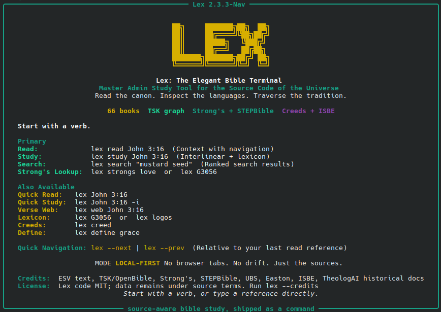

# Lex
### lex is the elegant bible terminal



**A local-first Bible study terminal for reading, searching, studying, and exporting Scripture work.**

Lex is a Python CLI that keeps Bible study fast and offline. It combines Scripture reading, interlinear study, Strong's and STEPBible lexicon notes, Treasury of Scripture Knowledge cross-references, dictionary/encyclopedia lookups, and historical Christian documents in one terminal tool.

```bash
lex study John 1:1
lex search covenant -major
lex web Romans 1:1
```

Current CLI: `./lex.py`  
Current version: `2.3.3-Nav`

## Highlights

| Feature | What it does |
| --- | --- |
| Scripture reading | Read a verse with context or a full chapter from the local Bible DB. |
| Study mode | Show verse context, source text, transliteration, interlinear rows, lexicon notes, and TSK links. |
| Scoped search | Search all Scripture, one book, a book range, or a canon section such as `-major`, `-gospels`, or `-nt`. |
| Verse web | Print a verse as the center point with ranked local cross-reference connections. |
| Exports | Save search pages and study packets as DOCX or PDF. |
| Creeds | Browse historical Christian documents by tradition and section. |
| Local data | Runs against local SQLite/JSON data stores with no web request required for normal use. |

## Quick Start

Clone the repo into whatever folder you want Lex to live in:

```bash
git clone https://github.com/elcafe7/lex.git
cd lex
```

Install Python dependencies if your machine does not already have them:

```bash
python3 -m pip install -r requirements.txt
```

Register the `lex` command for your Bash shell:

```bash
chmod +x setup.sh
./setup.sh
```

The setup script does not download databases or JSON components. It only:

1. Makes `lex.py` executable.
2. Writes/updates `alias lex='<clone-folder>/lex.py'` in `~/.bashrc`.
3. Creates `~/.local/bin/lex` as a convenience symlink.

Restart your terminal, or run:

```bash
source ~/.bashrc
```

Now you can run Lex from anywhere or directly from the clone:

```bash
lex John 3:16
# OR
./lex.py study John 1:1
```

The GitHub repo includes the runtime SQLite databases and the compact JSON
bundle under `runtime-data/`, so normal install does not need a second data
download step.

## Reading

References are forgiving. Full names and common abbreviations both work:

```bash
lex read John 3:16
lex John 1
lex jn 1:1
lex rom 8:1
lex 2 jn 1:2
```

Move from the last opened passage:

```bash
lex --next
lex --prev
```

## Study Mode

Study mode is the main workbench:

```bash
lex study John 1:1
lex study Genesis 1:1
lex John 3:16 -i
```

It renders:

- verse context
- Greek or Hebrew/Aramaic source text
- transliteration
- interlinear alignment
- Strong's and STEPBible-backed lexicon notes
- local TSK cross-references

In an interactive terminal, study mode ends with a compact action bar:

```text
n / p  next or previous verse
r      read context
w      verse web
e      export
q      done
```

Exports are saved under:

```text
~/Documents/lex_exports/studies
```

Lex tries to open exported files automatically after saving.

## Search

Search starts with an exact phrase query. If that finds nothing, Lex falls back to an all-terms search.

```bash
lex search israel
lex search "kingdom of god"
lex search covenant --page 2
lex search covenant --limit 20
```

Limit search by book, book range, or group:

```bash
lex search covenant -jeremiah
lex search beast -daniel-revelation
lex search resurrection -nt
lex search covenant -major
```

Useful group scopes:

```text
-ot                 -old-testament
-nt                 -new-testament
-law                -pentateuch        -torah
-history
-wisdom             -poetry
-major              -major-prophets
-minor              -minor-prophets
-prophets
-gospels
-epistles           -letters
-pauline
-general-epistles
```

Interactive search uses a compact action bar:

```text
1-10   study result
r #    read result
n / p  page
e      export
q      quit
```

Search exports are saved under:

```text
~/Documents/lex_exports
```

## Verse Web

Verse web mode shows a passage as the visual center, then prints ranked local cross-reference connections with previews:

```bash
lex web John 3:16
lex web Romans 1:1 --limit 8
```

## Lexicons, Definitions, And Creeds

Strong's lookup:

```bash
lex G3056
lex H7225
lex strongs love
```

Dictionary and encyclopedia lookup:

```bash
lex define covenant
lex define heliodorus
```

Creeds and confessions:

```bash
lex creed
lex creed nicene
lex creed westminster confession
```

## Documentation

- [User Guide](docs/USER_GUIDE.md)
- [Developer Guide](docs/DEVELOPER_GUIDE.md)
- [Lex CLI Component](docs/components/LEX_CLI.md)
- [Runtime Data Stores](docs/components/DATA_STORES.md)
- [Bible DB Builder](docs/components/BIBLE_DB_BUILDER.md)
- [Encyclopedia Importer](docs/components/ENCYCLOPEDIA_IMPORTER.md)
- [Bible Edition Standard](docs/BIBLE_EDITION_STANDARD.md)
- [Licensing Notes](docs/LICENSING.md)

## Data Sources

Lex currently uses local data from:

- ESV-derived Bible database
- Treasury of Scripture Knowledge / OpenBible-style cross-references
- Strong's Hebrew/Greek lexicon data
- STEPBible Greek/Hebrew lexicons
- UBS open-license resources
- Easton's Bible Dictionary
- International Standard Bible Encyclopedia OCR import
- TheologAI historical documents
- Bible geocoding data

The encyclopedia import is incomplete: the current local ISBE import only covers Volume II, `Clement-Heresh`.

## License And Data Terms

Lex application code is intended to be MIT licensed. Bundled and generated data remains under each upstream source's own license or terms.

Do not represent generated databases or third-party datasets as MIT licensed. See [Licensing Notes](docs/LICENSING.md).

## Developer Checks

```bash
python3 -m py_compile ./lex.py
python3 ./lex.py
python3 ./lex.py --credits
python3 ./lex.py study James 1:1
python3 ./lex.py search covenant -major --limit 2
python3 ./lex.py 2 jn 1:2
```

## Project Status

Lex is usable as a local CLI today. Packaging is still intentionally simple: the tracked entrypoint is `lex.py`, and the current repo includes generated local databases needed by that script. A proper Python package/release workflow is a good next milestone.
