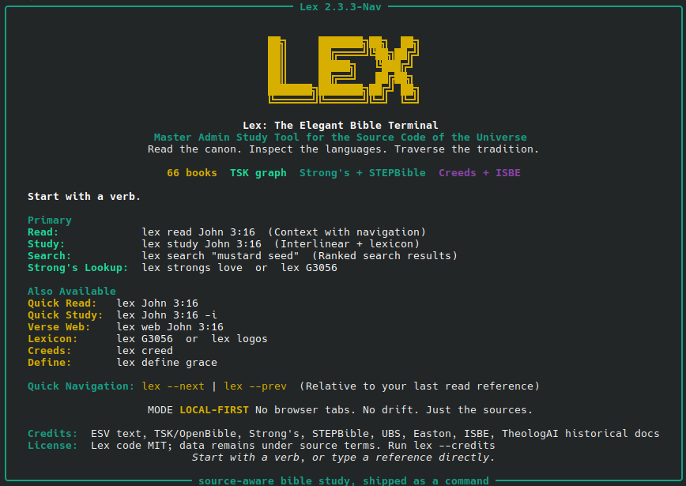
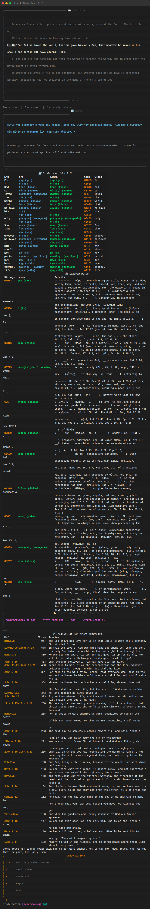
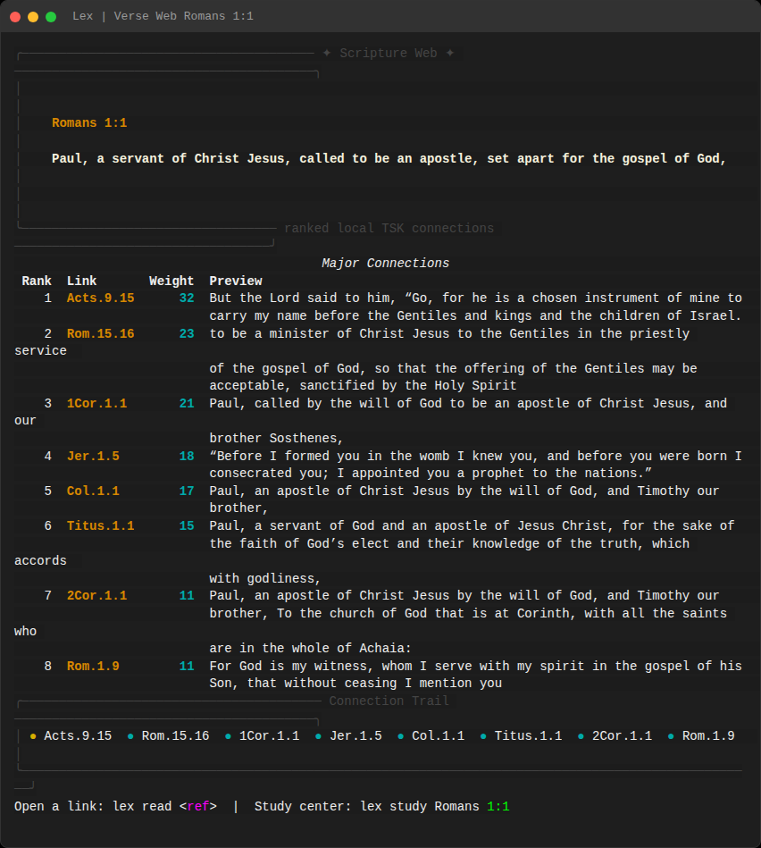
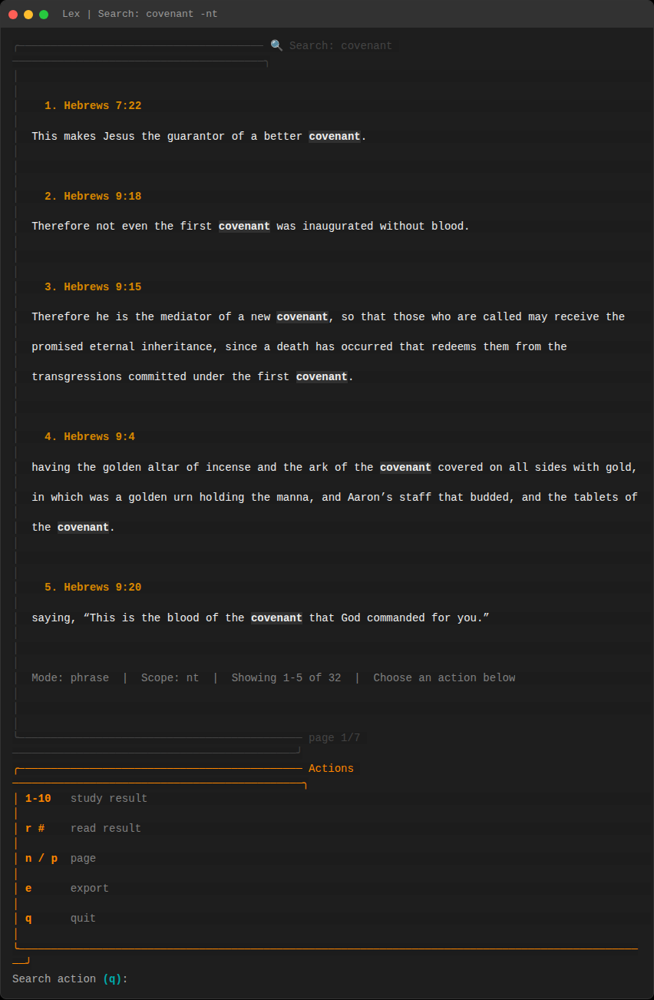
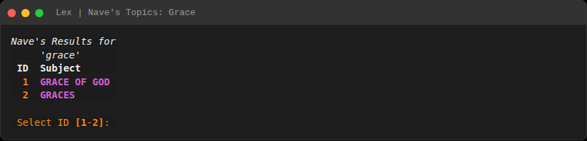

# Lex | The Elegant Bible Terminal 📖



**A local-first Bible study terminal for reading, searching, studying, and exporting Scripture work.**

Lex is a high-signal CLI tool for the modern student of Scripture. It keeps your study fast, offline, and beautiful. By combining multiple Bible versions, interlinear study, Strong's & STEPBible lexicons, the Treasury of Scripture Knowledge, and historical creeds into a single terminal interface, Lex transforms your shell into a distraction-free theological workbench.

```bash
lex study John 1:1
lex naves grace
lex web Romans 1:1
```

Current version: `2.5.1`


---

## 🖼️ Gallery

<p align="center">
  
  <br>
  <i>Study Mode: Interlinear source text, transliteration, and lexicon notes.</i>
</p>

---

## ⚡ Highlights

| Feature | Description |
| :--- | :--- |
| **Multi-Version** | ESV, KJV (1769 & 1611), NASB '95, Geneva 1587, Septuagint (LXX), and Vulgate. |
| **Unified Nave's** | Look up topics (e.g., `lex naves grace`) or find topical associations for any verse (e.g., `lex naves John 3:16`). |
| **Interlinear Study** | Source text, transliteration, and lexicon notes in a surgically precise terminal view. |
| **Verse Web** | Visualize local cross-reference connections ranked by relevance with instant previews. |
| **Historical Creeds** | Instant access to the Nicene Creed, Westminster Confession, and other major historical documents. |
| **Modern Aesthetics** | Auto-detecting light/dark themes with high-contrast, "Blueprint Technical" or "Studio Light" palettes. |
| **Export Engine** | Generate `.docx`/`.pdf` study packets and search results, plus read-mode PNG/PPTX and verse-slide PPTX exports. |
| **Zero Web Dependency** | Runs against local SQLite/JSON stores. Fast, private, and works on a plane. |

---

<p align="center">
  
  <br>
  <i>Verse Web: Visualizing cross-reference connections for Romans 1:1.</i>
</p>

---

## 🚀 Installation

### Recommended: Full Git Install
Lex is local-first and ships with several hundred MB of SQLite/JSON runtime
data. The most reliable install is a full Git clone plus the setup script.
Python 3.12 or newer is required:

```bash
git clone https://github.com/elcafe7/lex.git
cd lex
./setup.sh
```

`setup.sh` creates a repo-local Python virtual environment, installs the Python
dependencies, and writes a `lex` wrapper to `~/.local/bin`. The wrapper runs
the checkout's `lex.py` directly, so local source changes take effect without a
separate package reinstall.

### Package Managers
Homebrew, pip-from-GitHub, and Scoop installs are not the primary path right
now because Lex runtime data is large and must be present for offline use. Use
the full Git install above unless you are testing package-manager formulas.

### Updating
To update code in a Git checkout:

```bash
git pull
./setup.sh
```

To refresh runtime data only:

```bash
lex update
```

`lex update` is intentionally data-only. Application code updates should come
from Git plus `./setup.sh`; the updater does not overwrite the installed CLI
script.

---

## 📖 Basic Usage

### Reading
References are forgiving. Abbreviations like `jn`, `rom`, or `gn` work perfectly.

```bash
lex John 3:16        # Read a specific verse
lex Romans 8         # Read a whole chapter
lex --next           # Move to the next verse from your last position
lex history          # Show recent Lex commands
lex -B lxx Gen 1:1   # Read from the Septuagint
```

### Study Mode (`-i` or `study`)
This is the main workbench. It renders the selected-version verse context first,
then source text, interlinear rows, lexicon notes, topical associations, and TSK
cross-references. English-version OT study stays Masoretic-oriented through the
local ESV Hebrew/Aramaic interlinear packet. Septuagint and Vulgate study modes
are in progress and should remain separate selected-version paths (`-B lxx` and
`-B vulg`) as their data layers mature. LXX/Vulgate study data should not
auto-populate when studying an English Bible.

```bash
lex study John 1:1
lex John 3:16 -i
lex -B lxx Genesis 1:1 -i
```

Interactive study actions include next/previous verse, read context, verse web,
and export. Study export supports DOCX/PDF packets and a PPTX verse slide.

### Search & Scopes
Lex search is fast and scoped. You can search the whole Bible or narrow it down to specific canons.

<p align="center">
  
</p>

```bash
lex search "kingdom of god"
lex search covenant -nt        # Search only the New Testament
lex search beast -major        # Search only Major Prophets
lex search "holy spirit" -paul  # Search only Pauline Epistles
```

---

## 🏛️ Reference & Theology

### Nave's Topical Bible
Lex features a unified Nave's engine. Use it to find verses by topic or topics by verse.

<p align="center">
  
</p>

```bash
lex naves faith        # Show verses tagged with "Faith"
lex naves John 3:16    # Show all Nave's topics associated with this verse
```


### Lexicons & Dictionary
Lookup Strong's numbers or English definitions directly.

```bash
lex G3056              # Lookup Greek 'Logos'
lex H7225              # Lookup Hebrew 'Reshit'
lex define propitiation
```

### Creeds & Confessions
```bash
lex creed              # List available creeds
lex creed nicene
lex creed westminster
```

---

## 🎨 Themes & Customization
Lex automatically chooses a theme based on your terminal background.

```bash
lex -light             # Force Studio Light theme
lex -dark              # Force Blueprint Technical theme
lex -auto              # Revert to automatic detection
```

---

## 🗃️ Data Sources
Lex is built on the shoulders of giants. Data is sourced from:
- ESV-derived Bible database
- CCAT LXX morphology and local Septuagint/apocrypha import
- Treasury of Scripture Knowledge (OpenBible)
- STEPBible & Strong's Lexicon data
- Easton's Bible Dictionary & ISBE
- TheologAI Creedal Database

---

## 📄 License
Lex code is MIT licensed. Bible data and Lexicon content are subject to their respective upstream licenses. See [LICENSING.md](docs/LICENSING.md) for details.

---
*Created with care for the Church and the Terminal.*
